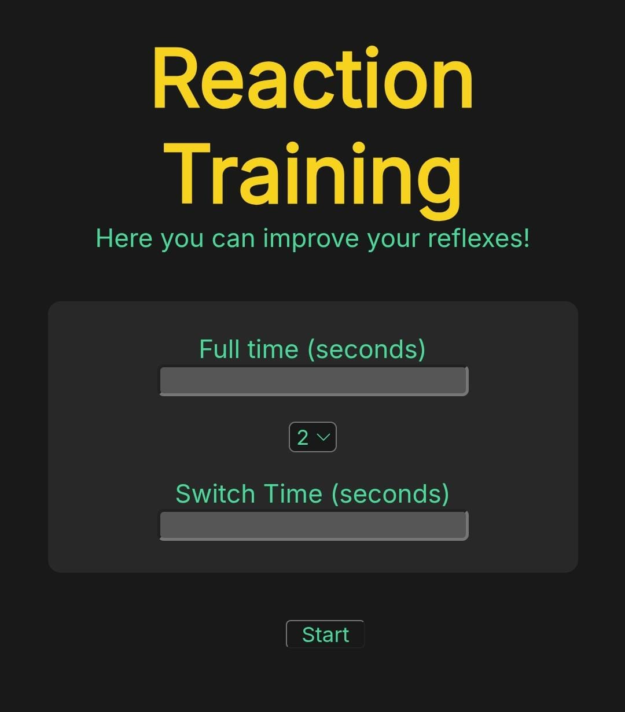

# Reaction Training

A simple and functional website for training your reaction time. With this tool, you can easily **control your rhythm, time, and options to improve your reflexes.** 

Initially, this website was designed for training alone, without any special equipment just using your phone, tablet, or any device with internet access.

---
<div align="center">
  
</div>


## Features
- Adjustable reaction time settings.
- Simple and intuitive interface.
- Works on any device with internet access.

## Website
🔗 [Website ->](#) *(https://reactiontraining.netlify.app/)*

## Technologies Used
- HTML
- CSS
- JavaScript

## Installation
To run this project locally:
```sh
git clone https://github.com/your-username/Reaction-Training.git
cd Reaction-Training
code .
```

## Contributing

Contributions are welcome! Please feel free to submit a Pull Request.

1. Fork the repository
2. Create your feature branch (`git checkout -b feature/amazing-feature`)
3. Commit your changes (`git commit -m 'Add some amazing feature'`)
4. Push to the branch (`git push origin feature/amazing-feature`)
5. Open a Pull Request

Please make sure your code follows our style guide and passes all tests.

For major changes, please open an issue first to discuss what you would like to change.
